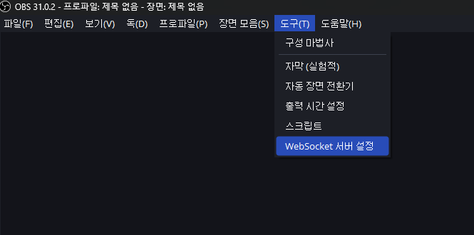
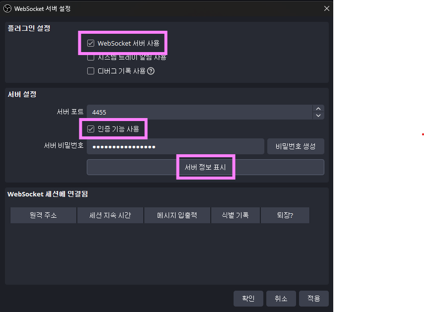
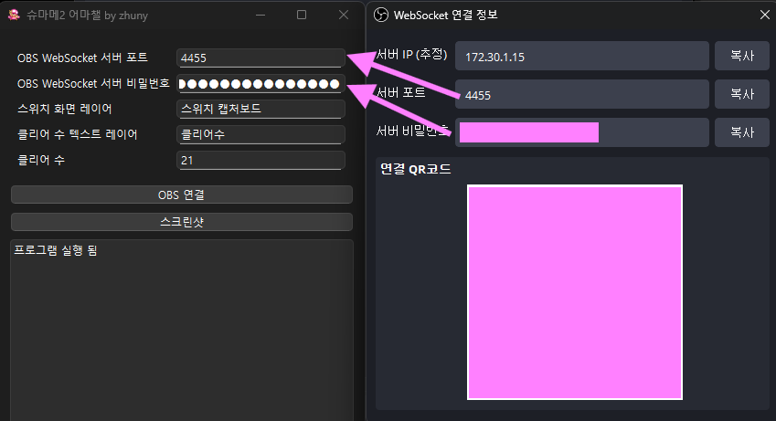
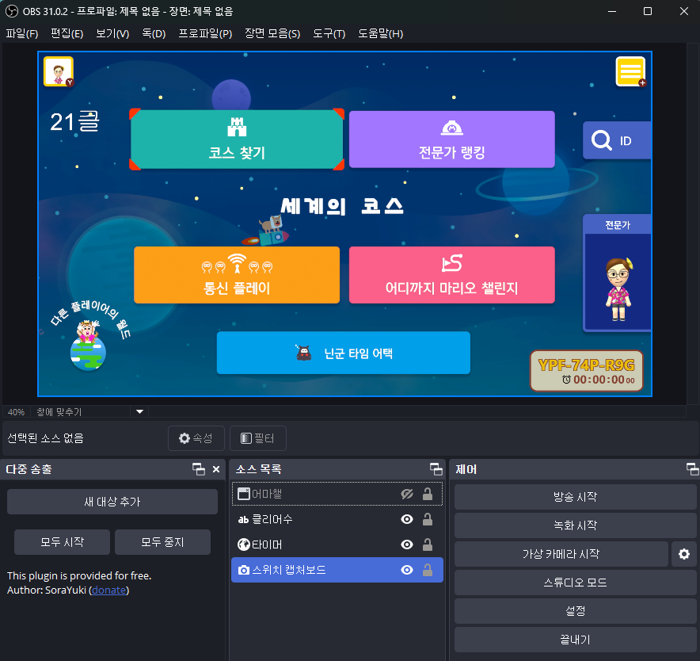
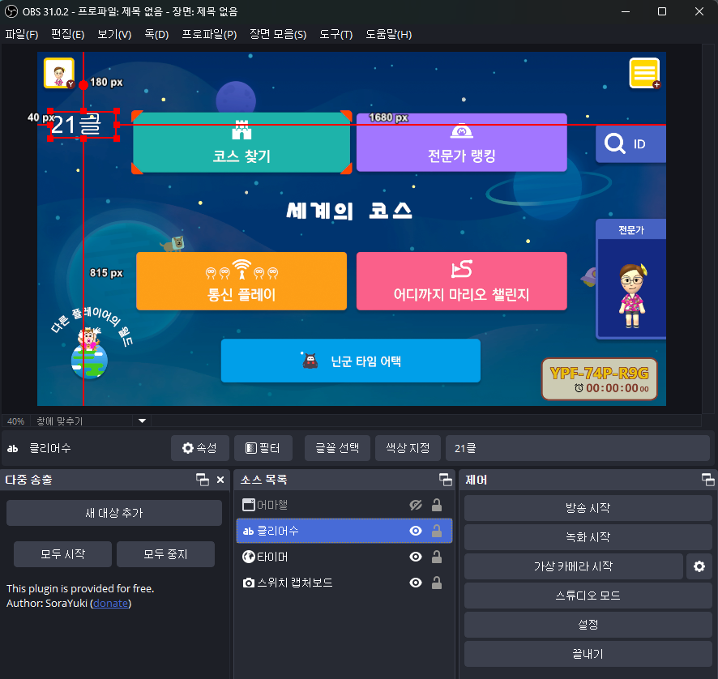
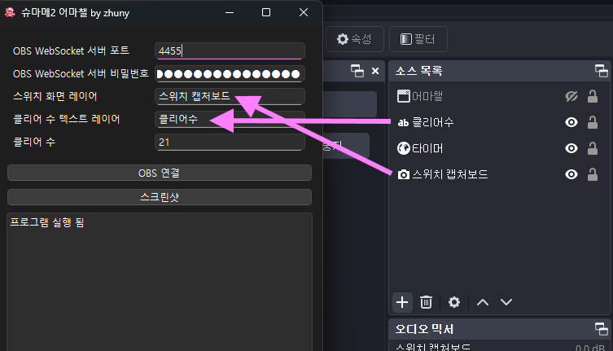
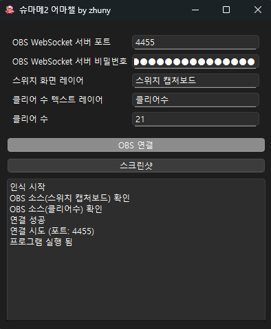
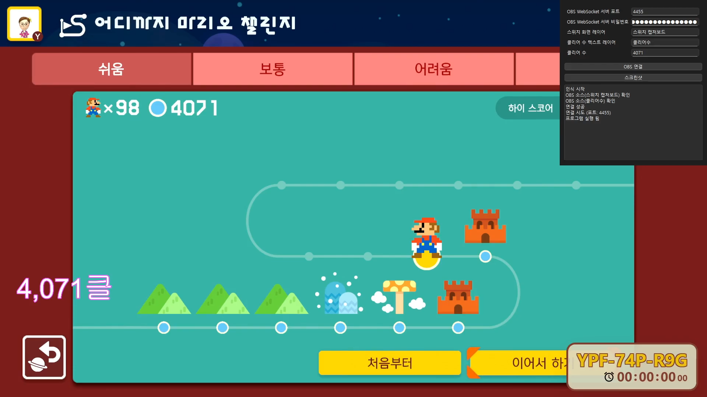

# smm-with-obs
슈마메 어마챌 진행 시, 클리어 수를 자동으로 올려줍니다.

## 세팅 방법
### OBS WebSocket 설정
1. OBS 메뉴에서 `도구 > WebSocket 서버 설정`을 실행합니다.

2. 창에서 WebSocket 서버 사용 설정을 합니다. 아래와 같이 세팅한 후, `서버 정보 표시`를 실행합니다.
간혹, 공공 인터넷에 OBS를 허용할 것인지 물을 수 있는데, 특수하게 사용할 게 아니라면 `아니오`를 선택하는게 좋습니다.

3. WebSocket의 연결 정보를 프로그램에 입력합니다. 서버 포트와 비밀번호를 입력하면 됩니다.

### 소스 설정
1. OBS 소스에서 슈마메 소스와, 클 수를 보여주는 텍스트 소스를 확인합니다.

2. 슈마메 소스와 텍스트 소스 이름을 프로그램에 입력합니다.

3. 현재 클리어 수를 입력하고, `OBS 연결` 버튼을 클릭합니다. 정상적으로 작동했다면 아래와 비슷한 로그가 추가됩니다.

4. 어마챌을 진행합니다.

### 데모
하단 이미지 클릭 시, 유튜브 영상으로 넘어갑니다.

데모 영상은 어마챌에서 클리어 했을 때 클 수가 올라가는 것과, 어마챌 밖에서 맵을 클리어 했을 경우를 대응하고 있습니다.
데모에서는 시간 상의 이유로 어마챌 Easy에서 클리어 한 것만 있지만, 다른 난이도에 대해서도 대응하고 있습니다.

